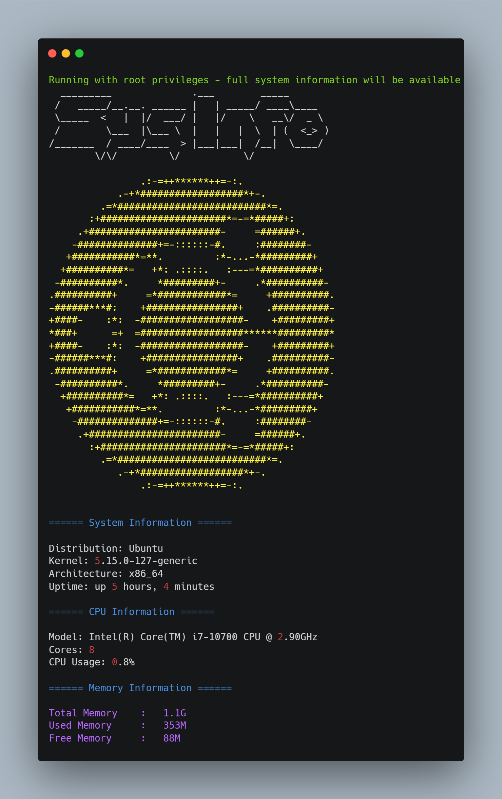
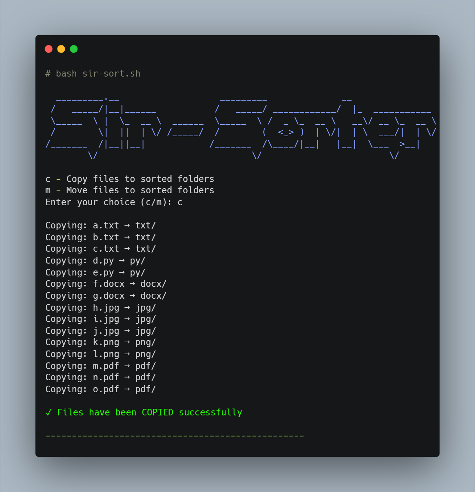

# Shebang - Bash Script Collection

A collection of useful bash scripts for system administration and file management tasks.

## Scripts

## sysinfo.sh
A comprehensive system information script that displays:
- System details (distribution, kernel, architecture)
- CPU information 
- Memory usage
- Disk usage
- Network information
- GPU details
- Features colorized output and ASCII art logos

**Preview:**


___________________________________________________________________

## sir-sorter.sh
A file organization utility that:
- Sorts files into directories based on their extensions
- Provides both copy and move operations
- Features an ASCII art banner
- Uses color-coded output for better visibility

**Preview:**



___________________________________________________________________

## docker-install.sh
An automated Docker installation script that:
- Supports multiple Linux distributions (Ubuntu, Debian, CentOS, Rocky Linux)
- Checks for root privileges
- Detects OS distribution
- Validates existing Docker installations
- Provides colored status messages

___________________________________________________________________

## Usage

All scripts can be made executable with:

```bash
chmod +x script_name.sh
```

To run a script, use:

```bash
./script_name.sh
```


